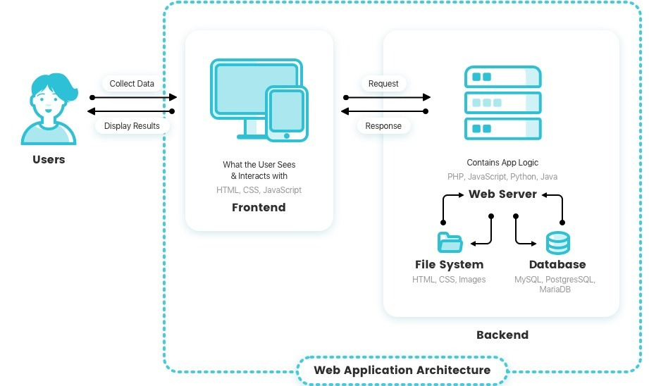

## Web Application Architecture

## Overview 

This guide provides a detailed description of a Web Application. The description explains how the architecture works, as well as the elements, properties, and relationships that it contains. 

The Web Application is an internet-based platform that includes the following main components:

- <u>Users</u>
- <u>Frontend</u> 
- <u>Backend</u> 

This structure represents the data flow from the Backend to Users. In the next section you can find detailed information about how these elements interact. 

## Diagram

The following diagram illustrates the detailed architecture of a Web Application. 

**Figure 1. Detailed Diagram of Web Application Architecture** 

###### source: [available here](https://reinvently.com/blog/fundamentals-web-application-architecture/)

The Web Application comprises the following elements, properties, and relationships: 

## Users

In the Web Application, the User comprises of the following elements, properties, and relationships: 

- **Elements:** User 
- **Properties:** The User submits a data request to the Frontend.   
- **Relationships:** The User has a bi-directional relationship with the Frontend. As the User interacts with content the Frontend, they submit a data request. The Frontend receives that request and forwards it. Once the Frontend has the response, it displays that response to the User.   

## Frontend

- **Elements:** The Frontend is composed of HTML, CSS, and JavaScript.   
- **Properties:** The Frontend renders static and dynamic content in the Web Browser, and is what the User sees and interacts with.    
- **Relationships:** The Frontend has a bi-directional relationship with the User, as well as with the Backend. The Frontend receives the request from the User and forwards it to the Backend. When the Backend forwards the response to the Frontend, the Frontend displays the response to the User.   

## Backend 

- **Elements:** 
  - **Web Server:** The Web Server has two components: a File System and a Database. It contains PHP, JavaScript, Python, and Java.   
  - **File System:** A File System is composed of HTML, CSS, and stores images. 
  - **Database:** A Database stores data. The Databases in this architecture are: MySQL, PostgresSQL, and MariaDB. 
- **Properties:** The Backend is responsible for receiving the request from the Frontend, and responding to it. 
- **Relationships:** The Backend contains a Web Server. This Web Server has a bi-directional relationship with the Frontend, as well as the Web Server's File system and Database. Depending on the type of request, the Web Sever will either forward the request to the File System or Database. Once the request is fullfilled on the Backend, the Web Server will push it to the Frontend. 